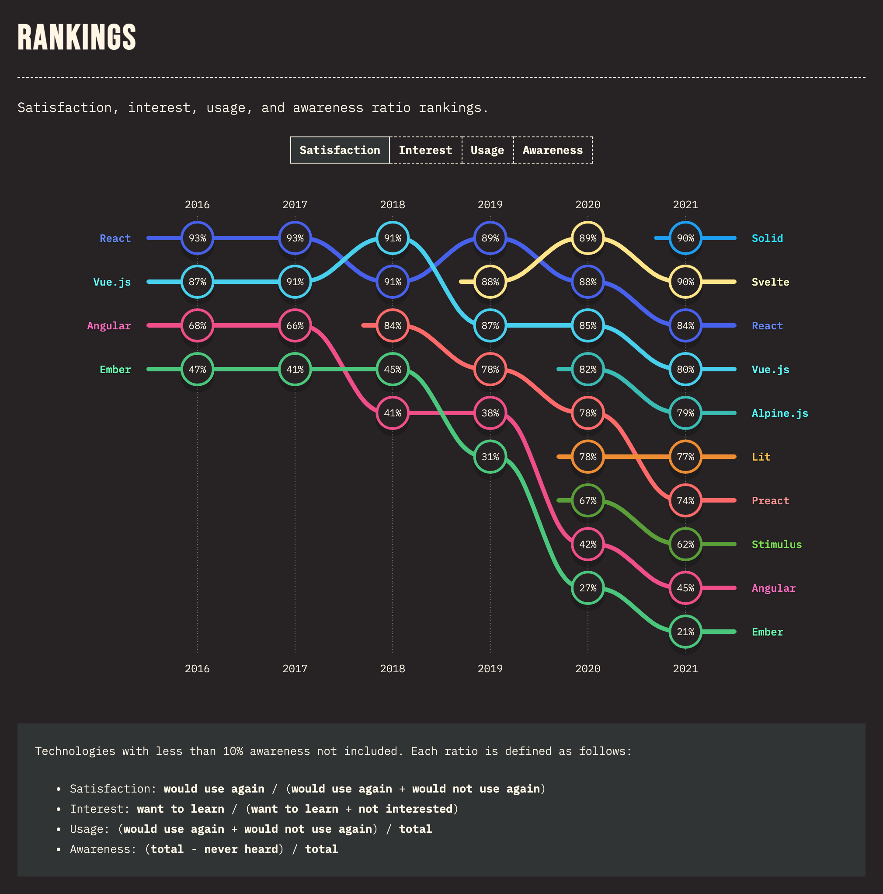
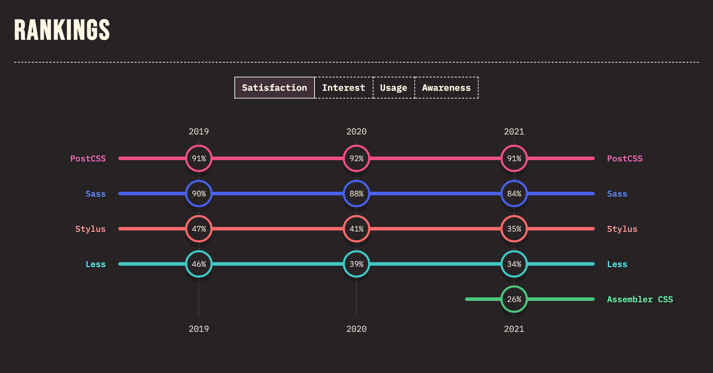
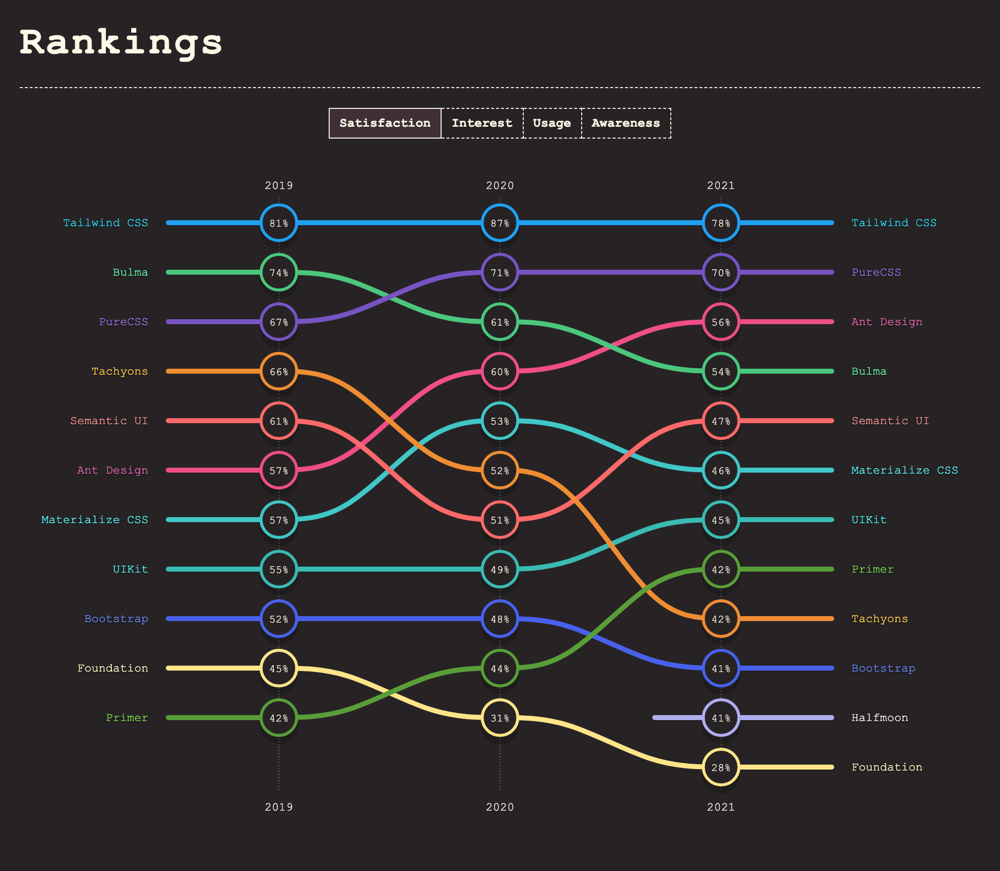
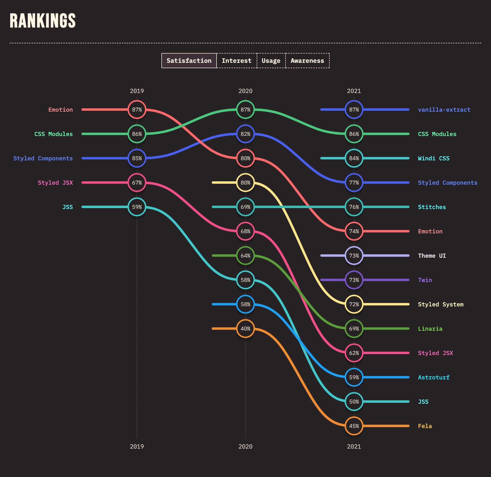

# My FE Tech Stack

> This document is under development 🚧 and for reference purposes only 🔍. I chose libraries that suit me best.

## 1. Technologies:

<table>
    <tr>
        <th></th>
        <th>
Learning
</th>
        <th>
Interested
</th>
    </tr>
    <tr>
        <td>Framework</td>
        <td align="center">
            
            
<code><a href="https://reactjs.org/">React</a></code>

        </td>
        <td align="center">
            
            
            
<code><a href="https://www.solidjs.com/">SolidJS</a></code>

            
            
            
<code><a href="https://nextjs.org/">NextJS</a></code>

        </td>
    </tr>
    <tr>
        <td>Routing</td>
        <td align="center">
            
            
<code><a href="https://reactrouter.com/docs/en/v6">React Router v6</a></code>

        </td>
        <td align="center">
        </td>
    </tr>
    <tr>
        <td>State Management</td>
        <td align="center">
            
            
<code><a href="https://redux-toolkit.js.org/">Redux Toolkit</a></code>

        </td>
        <td align="center">
            
            
            
<code><a href="https://recoiljs.org/">Recoil</a></code>

        </td>
    </tr>
    <tr>
        <td>Data Fetching</td>
        <td align="center">
            
            
            
<code><a href="https://react-query.tanstack.com/">Redux Query</a></code>

        </td>
        <td align="center">
        </td>
    </tr>
    <tr>
        <td>Component Styling</td>
        <td align="center">
            
            
<code><a href="https://windicss.org/">WindiCSS</a></code>

        </td>
        <td align="center">
            
            
<code><a href="https://vanilla-extract.style/">Vanilla Extract</a></code>

        </td>
    </tr>
    <tr>
        <td>UI Component Library</td>
        <td align="center">
            
            
            
<code><a href="https://mantine.dev/">Mantine</a></code>

        </td>
        <td align="center">
            
            
<code><a href="https://ant.design/">Ant Design</a></code>

            
            
            
<code><a href="https://chakra-ui.com/">Chakra UI</a></code>

        </td>
    </tr>
    <tr>
        <td>Build Tool</td>
        <td align="center">
            
            
<code><a href="https://vitejs.dev/">Vite</a></code>

        </td>
        <td align="center">
        </td>
    </tr>
    <tr>
        <td>Icon</td>
        <td align="center">
            
            
<code><a href="https://iconify.design/">Iconify</a></code>

        </td>
        <td align="center">
        </td>
    </tr>
</table>

## 2. Description:

### 2.1. Framework:

> 🤖 `React`: Why **React**? It's popular, has a large community, and has a shallow learning curve, that's it.

Other alternatives:

- Vuejs
- Svelte
- Angular
- ...

Comparisons:

State of JS 2020

_Data from [StateOfJS 2020](https://2020.stateofjs.com/en-US/technologies/front-end-frameworks/)_

---

### 2.2. Routing:

> 🤖 `React router`: **React router** is the most popular routing library for React. Others have
> less popularity.

Other alternatives:

- Reach Router: https://reach.tech/router/
- The Navigation router: https://grahammendick.github.io/navigation/
- hookrouter: https://github.com/Paratron/hookrouter
- raviger: https://kyeotic.github.io/raviger/

Blogs:

- Robin Wieruch's Blog: https://www.robinwieruch.de/categories/react-router-6/

---

### 2.3. State Management:

> 🤖 `Redux Toolkit`: No Description.

Other alternatives:

- **Redux Toolkit**: https://redux-toolkit.js.org/
- MobX: https://mobx.js.org/README.html
- Zustand: https://github.com/pmndrs/zustand
- xState: https://xstate.js.org/docs/
- Jotai: https://jotai.org/
- valtio: https://github.com/pmndrs/valtio
- **Recoil**: https://recoiljs.org/

More: https://openbase.com/categories/js/best-react-state-management-libraries

Blogs:

- Past, Present, and Future of React State Management: https://leerob.io/blog/react-state-management
- Redux vs Recoil: which should you use?: https://www.emgoto.com/redux-vs-recoil/
- Redux Vs. Recoil: Why I’ve Moved from Redux to Recoil for State Management: https://javascript.plainenglish.io/moving-from-redux-to-recoil-42aa9d9cfaad
- Why I stopped using Redux and Used Recoil Instead:
  https://dev.to/akashshyam/why-i-stopped-using-redux-and-used-recoil-instead-e6a

---

### 2.4. Data fetching:

> 🤖 `React Query`: Based on the comparison below, I think react-query is better.

Other alternatives:

- RTK Query: https://redux-toolkit.js.org/rtk-query/overview
- SWR: https://swr.vercel.app/
- Apollo: https://www.apollographql.com/
- urql: https://formidable.com/open-source/urql/

Blogs:

- TkDodo's Blog: https://react-query.tanstack.com/community/tkdodos-blog

Comparisons:

<b>React Query</b>'s comparison: <a href="https://react-query.tanstack.com/comparison">https://react-query.tanstack.com/comparison</a>

> This comparison table strives to be as accurate and as unbiased as possible. If you use any of these libraries and feel the information could be improved, feel free to suggest changes (with notes or evidence of claims) using the "Edit this page on Github" link at the bottom of this page.

Feature/Capability Key:

- ✅ 1st-class, built-in, and ready to use with no added configuration or code
- 🟡 Supported, but as an unofficial 3rd party or community library/contribution
- 🔶 Supported and documented, but requires extra user-code to implement
- 🛑 Not officially supported or documented.

|                                                    | React Query                              | SWR [_(Website)_][swr]      | Apollo Client [_(Website)_][apollo]   | RTK-Query [_(Website)_][rtk-query]   |
| -------------------------------------------------- | ---------------------------------------- | --------------------------- | ------------------------------------- | ------------------------------------ |
| Github Repo / Stars                                | [![][stars-react-query]][gh-react-query] | [![][stars-swr]][gh-swr]    | [![][stars-apollo]][gh-apollo]        | [![][stars-rtk-query]][gh-rtk-query] |
| Platform Requirements                              | React                                    | React                       | React, GraphQL                        | Redux                                |
| Their Comparison                                   |                                          | (none)                      | (none)                                | [Comparison][rtk-query-comparison]   |
| Supported Query Syntax                             | Promise, REST, GraphQL                   | Promise, REST, GraphQL      | GraphQL                               | Promise, REST, GraphQL               |
| Supported Frameworks                               | React                                    | React                       | React + Others                        | Any                                  |
| Supported Query Keys                               | JSON                                     | JSON                        | GraphQL Query                         | JSON                                 |
| Query Key Change Detection                         | Deep Compare (Stable Serialization)      | Shallow Compare             | Deep Compare (Unstable Serialization) | Referential Equality (===)           |
| Query Data Change Detection                        | Deep Comparison + Structural Sharing     | Deep Compare (via `dequal`) | Deep Compare (Unstable Serialization) | Referential Equality (===)           |
| Query Data Memoization Level                       | Query + Structural Sharing               | Query                       | Query + Entity + Structural Sharing   | Query                                |
| Bundle Size                                        | [![][bp-react-query]][bpl-react-query]   | [![][bp-swr]][bpl-swr]      | [![][bp-apollo]][bpl-apollo]          | [![][bp-rtk-query]][bpl-rtk-query]   |
| API Definition                                     | On-Use, Declarative                      | On-Use                      | GraphQL Schema                        | Declarative                          |
| Queries                                            | ✅                                       | ✅                          | ✅                                    | ✅                                   |
| Caching                                            | ✅                                       | ✅                          | ✅                                    | ✅                                   |
| Devtools                                           | ✅                                       | 🟡                          | ✅                                    | ✅                                   |
| Polling/Intervals                                  | ✅                                       | ✅                          | ✅                                    | ✅                                   |
| Parallel Queries                                   | ✅                                       | ✅                          | ✅                                    | ✅                                   |
| Dependent Queries                                  | ✅                                       | ✅                          | ✅                                    | ✅                                   |
| Paginated Queries                                  | ✅                                       | ✅                          | ✅                                    | ✅                                   |
| Infinite Queries                                   | ✅                                       | ✅                          | ✅                                    | 🛑                                   |
| Bi-directional Infinite Queries                    | ✅                                       | 🔶                          | 🔶                                    | 🛑                                   |
| Infinite Query Refetching                          | ✅                                       | ✅                          | 🛑                                    | 🛑                                   |
| Lagged Query Data1                      | ✅                                       | 🔶                          | 🛑                                    | ✅                                   |
| Selectors                                          | ✅                                       | 🛑                          | ✅                                    | ✅                                   |
| Initial Data                                       | ✅                                       | ✅                          | ✅                                    | ✅                                   |
| Scroll Recovery                                    | ✅                                       | ✅                          | ✅                                    | ✅                                   |
| Cache Manipulation                                 | ✅                                       | ✅                          | ✅                                    | ✅                                   |
| Outdated Query Dismissal                           | ✅                                       | ✅                          | ✅                                    | ✅                                   |
| Render Batching & Optimization2         | ✅                                       | 🛑                          | 🛑                                    | ✅                                   |
| Auto Garbage Collection                            | ✅                                       | 🛑                          | 🛑                                    | ✅                                   |
| Mutation Hooks                                     | ✅                                       | 🟡                          | ✅                                    | ✅                                   |
| Offline Mutation Support                           | ✅                                       | 🛑                          | 🟡                                    | 🛑                                   |
| Prefetching APIs                                   | ✅                                       | 🔶                          | ✅                                    | ✅                                   |
| Query Cancellation                                 | ✅                                       | 🛑                          | 🛑                                    | 🛑                                   |
| Partial Query Matching3                 | ✅                                       | 🛑                          | 🛑                                    | ✅                                   |
| Stale While Revalidate                             | ✅                                       | ✅                          | ✅                                    | ✅                                   |
| Stale Time Configuration7               | ✅                                       | 🛑                          | 🛑                                    | ✅                                   |
| Pre-usage Query/Mutation Configuration4 | ✅                                       | 🛑                          | 🛑                                    | ✅                                   |
| Window Focus Refetching                            | ✅                                       | ✅                          | 🛑                                    | 🔶                                   |
| Network Status Refetching                          | ✅                                       | ✅                          | ✅                                    | 🔶                                   |
| General Cache Dehydration/Rehydration              | ✅                                       | 🛑                          | ✅                                    | ✅                                   |
| Offline Caching                                    | ✅ (Experimental)                        | 🛑                          | ✅                                    | 🔶                                   |
| React Suspense (Experimental)                      | ✅                                       | ✅                          | 🛑                                    | 🛑                                   |
| Abstracted/Agnostic Core                           | ✅                                       | 🛑                          | ✅                                    | ✅                                   |
| Automatic Refetch after Mutation5       | 🔶                                       | 🔶                          | ✅                                    | ✅                                   |
| Normalized Caching6                     | 🛑                                       | 🛑                          | ✅                                    | 🛑                                   |

### Notes

> **1 Lagged Query Data** - React Query provides a way to continue to see an existing query's data while the next query loads (similar to the same UX that suspense will soon provide natively). This is extremely important when writing pagination UIs or infinite loading UIs where you do not want to show a hard loading state whenever a new query is requested. Other libraries do not have this capability and render a hard loading state for the new query (unless it has been prefetched), while the new query loads.

> **2 Render Optimization** - React Query has excellent rendering performance. It will only re-render your components when a query is updated. For example, because it has new data, or to indicate it is fetching. React Query also batches updates together to make sure your application only re-renders once when multiple components are using the same query. If you are only interested in the `data` or `error` properties, you can reduce the number of renders even more by setting `notifyOnChangeProps` to `['data', 'error']`. Set `notifyOnChangeProps: 'tracked'` to automatically track which fields are accessed and only re-render if one of them changes.

> **3 Partial query matching** - Because React Query uses deterministic query key serialization, this allows you to manipulate variable groups of queries without having to know each individual query-key that you want to match, eg. you can refetch every query that starts with `todos` in its key, regardless of variables, or you can target specific queries with (or without) variables or nested properties, and even use a filter function to only match queries that pass your specific conditions.

> **4 Pre-usage Query Configuration** - This is simply a fancy name for being able to configure how queries and mutations will behave before they are used. For instance, a query can be fully configured with defaults beforehand and when the time comes to use it, only `useQuery(key)` is necessary, instead of being required to pass the fetcher and/or options with every usage. SWR does have a partial form of this feature by allowing you to pre-configure a default fetcher, but only as a global fetcher, not on a per-query basis, and definitely not for mutations.

> **5 Automatic Refetch after Mutation** - For truly automatic refetching to happen after a mutation occurs, a schema is necessary (like the one graphQL provides) along with heuristics that help the library know how to identify individual entities and entities types in that schema.

> **6 Normalized Caching** - React Query, SWR and RTK-Query do not currently support automatic-normalized caching which describes storing entities in a flat architecture to avoid some high-level data duplication.

> **6 SWR's Immutable Mode** - SWR ships with an "immutable" mode that does allow you to only fetch a query once for the life of the cache, but it still does not have the concept of stale-time or conditional auto-revalidation

<!-- -->

[bpl-react-query]: https://bundlephobia.com/result?p=react-query
[bp-react-query]: https://badgen.net/bundlephobia/minzip/react-query?label=💾
[gh-react-query]: https://github.com/tannerlinsley/react-query
[stars-react-query]: https://img.shields.io/github/stars/tannerlinsley/react-query?label=%F0%9F%8C%9F

<!-- -->

[swr]: https://github.com/vercel/swr
[bp-swr]: https://badgen.net/bundlephobia/minzip/swr?label=💾
[gh-swr]: https://github.com/vercel/swr
[stars-swr]: https://img.shields.io/github/stars/vercel/swr?label=%F0%9F%8C%9F
[bpl-swr]: https://bundlephobia.com/result?p=swr

<!-- -->

[apollo]: https://github.com/apollographql/apollo-client
[bp-apollo]: https://badgen.net/bundlephobia/minzip/@apollo/client?label=💾
[gh-apollo]: https://github.com/apollographql/apollo-client
[stars-apollo]: https://img.shields.io/github/stars/apollographql/apollo-client?label=%F0%9F%8C%9F
[bpl-apollo]: https://bundlephobia.com/result?p=@apollo/client

<!-- -->

[rtk-query]: https://redux-toolkit.js.org/rtk-query/overview
[rtk-query-comparison]: https://redux-toolkit.js.org/rtk-query/comparison
[bp-rtk]: https://badgen.net/bundlephobia/minzip/@reduxjs/toolkit?label=💾
[bp-rtk-query]: https://badgen.net/bundlephobia/minzip/@rtk-incubator/rtk-query?label=💾
[gh-rtk-query]: https://github.com/rtk-incubator/rtk-query
[stars-rtk-query]: https://img.shields.io/github/stars/rtk-incubator/rtk-query?label=%F0%9F%8C%9F
[bpl-rtk]: https://bundlephobia.com/result?p=@reduxjs/toolkit
[bpl-rtk-query]: https://bundlephobia.com/result?p=@rtk-incubator/rtk-query

<b>RTK Query</b>'s Comparison: <a href="https://redux-toolkit.js.org/rtk-query/comparison">https://redux-toolkit.js.org/rtk-query/comparison</a>

&nbsp;

Comparing Feature Sets

It's worth comparing the feature sets of all these tools to get a sense of their similarities and differences.

:::info

This comparison table strives to be as accurate and as unbiased as possible. If you use any of these libraries and feel the information could be improved, feel free to suggest changes (with notes or evidence of claims) by [opening an issue](https://github.com/reduxjs/redux-toolkit/issues/new).

:::

| Feature                                | rtk-query                               | [react-query]            | [apollo]                                                                            | [urql]                                                                                                      |
| -------------------------------------- | --------------------------------------- | ------------------------ | ----------------------------------------------------------------------------------- | ----------------------------------------------------------------------------------------------------------- |
| **Supported Protocols**                | any, REST included                      | any, none included       | GraphQL                                                                             | GraphQL                                                                                                     |
| **API Definition**                     | declarative                             | on use, declarative      | GraphQL schema                                                                      | GraphQL schema                                                                                              |
| **Cache by**                           | endpoint + serialized arguments         | user-defined query-key   | type/id                                                                             | type/id?                                                                                                    |
| **Invalidation Strategy + Refetching** | declarative, by type and/or type/id     | manual by cache key      | automatic cache updates on per-entity level, manual query invalidation by cache key | declarative, by type OR automatic cache updates on per-entity level, manual query invalidation by cache key |
| **Polling **                           | yes                                     | yes                      | yes                                                                                 | yes                                                                                                         |
| **Parallel queries **                  | yes                                     | yes                      | yes                                                                                 | yes                                                                                                         |
| **Dependent queries**                  | yes                                     | yes                      | yes                                                                                 | yes                                                                                                         |
| **Skip queries**                       | yes                                     | yes                      | yes                                                                                 | yes                                                                                                         |
| **Lagged queries**                     | yes                                     | yes                      | no                                                                                  | ?                                                                                                           |
| **Auto garbage collection**            | yes                                     | yes                      | no                                                                                  | ?                                                                                                           |
| **Normalized caching**                 | no                                      | no                       | yes                                                                                 | yes                                                                                                         |
| **Infinite scrolling**                 | TODO                                    | yes                      | requires manual code                                                                | ?                                                                                                           |
| **Prefetching**                        | yes                                     | yes                      | yes                                                                                 | yes?                                                                                                        |
| **Retrying**                           | yes                                     | yes                      | requires manual code                                                                | ?                                                                                                           |
| **Optimistic updates**                 | can update cache by hand                | can update cache by hand | `optimisticResponse`                                                                | ?                                                                                                           |
| **Manual cache manipulation**          | yes                                     | yes                      | yes                                                                                 | yes                                                                                                         |
| **Platforms**                          | hooks for React, everywhere Redux works | hooks for React          | various                                                                             | various                                                                                                     |

[react-query]: https://react-query.tanstack.com/
[apollo]: https://www.apollographql.com/
[urql]: https://formidable.com/open-source/urql/

Further Information

- The [React Query "Comparison" page](https://react-query.tanstack.com/comparison) has an additional detailed feature set comparison table and discussion of capabilities
- Urql maintainer Phil Pluckthun wrote [an excellent explanation of what a "normalized cache" is and how Urql's cache works](https://kitten.sh/graphql-normalized-caching)
- The [RTK Query "Cache Behavior" page](./usage/cache-behavior.mdx#tradeoffs) has further details on why RTK Query does not implement a normalized cache

---

### 2.5. Component Styling:

> 🤖: Although CSS frameworks like WindiCSS has quite a few drawbacks, I think
> with VSCode extensions and plugins, that's won't be a problem 🤷‍♂️.

> 🤖 `WindiCSS`: WindiCSS has more features than Tailwindcss, so I migrated to WindiCSS 💪.
>
> - Variant Group
> - Shortcuts: Simpler than Tailwindcss @apply
> - Attributify Mode
> - Design in Devtools from [vite-plugin-windicss](https://github.com/windicss/vite-plugin-windicss)

Other technologies:

- Inline CSS
- CSS Modules
- Pre/Post-processors: Scss, Less,...
- CSS-in-JS: Styled Components, Emotion, vanilla-extract,...
- Frameworks: WindiCSS, Tailwindcss,...

Blogs:

- Windi CSS: Is it a Tailwind CSS Killer?: https://raybo.org/posts/2021-11-25-Windi-CSS-The-Tailwind-CSS-Killer/
- Why I Don't Like Tailwind CSS:
  https://www.aleksandrhovhannisyan.com/blog/why-i-dont-like-tailwind-css/
- TailwindCSS: Adds complexity, does nothing: https://dev.to/brianboyko/tailwindcss-adds-complexity-does-nothing-3hpn
- The CSS-in-React Landscape: https://css-tricks.com/the-css-in-react-landscape/

Comparisons:

- Shopify replacing SASS strategy: https://github.com/Shopify/foundational-design-system-proto/discussions/44
- Shopify matrix comparisons:
  https://docs.google.com/spreadsheets/d/1rxrRTlbNWiLVu-Q5IK7xh5O1FmWcjyAS2XN7jiPrhYM/edit#gid=0
- React: CSS in JS techniques comparison:
  https://github.com/MicheleBertoli/css-in-js
- https://usablica.github.io/front-end-frameworks/compare.html
- Top utility-first CSS frameworks:
  https://blog.logrocket.com/top-utility-first-css-frameworks/
- Best CSS Frameworks in 2022: https://dev.to/theme_selection/best-css-frameworks-in-2020-1jjh

State of CSS 2021: Pre-/Post-processors

_Data from [StateOfCSS 2021](https://2021.stateofcss.com/en-US/technologies/pre-post-processors)_

State of CSS 2021: CSS Frameworks

_Data from [StateOfCSS 2021](https://2021.stateofcss.com/en-US/technologies/css-frameworks)_

State of CSS 2021: CSS-in-JS

_Data from [StateOfCSS 2021](https://2021.stateofcss.com/en-US/technologies/css-in-js)_

---

### 2.5. UI Components Library:

> 🤖 `Mantine`: Mantine is open source, has good reviews, many components.

Other alternatives:

- Material-UI: https://mui.com/
- Chakra-UI: https://chakra-ui.com/
- Ant Design: https://ant.design/
- Headless UI: https://headlessui.dev/
- Blueprint (not a mobile-first UI toolkit): https://blueprintjs.com/
- Semantic UI: https://semantic-ui.com/
- Fluent UI: https://github.com/microsoft/fluentui
- Rebass: https://rebassjs.org/
- Semi Design: https://semi.design/en-US
- Grommet: https://v2.grommet.io/
- Onsen UI (Mobile?): https://onsen.io/react/
- Evergreen: https://evergreen.segment.com/
- React Bootstrap: https://react-bootstrap.github.io/
- Reactstrap: https://reactstrap.github.io/?path=/story/home-installation--page
- Reakit: https://reakit.io/
- Ring UI: https://jetbrains.github.io/ring-ui/master/

Blogs:

- https://www.reddit.com/r/reactjs/comments/a6qhbr/checked_21_react_ui_kits_briefly_im_done/

---

### 2.6. UI Component Testing:

> 🤖 `Storybook`: Found it on: https://risingstars.js.org/2021/en. Will integrate into my apps.

Other alternatives:

- Atellier
- React Cosmos
- Docz
- Carte Blanche
- React Styleguide Generator
- React Bluekit

Blogs:

- Alternatives to React Storybook: https://blog.logrocket.com/alternatives-to-react-storybook/

---

### 2.7. Lint tool:

> 🤖 `ESLint`: ESLint is the most popular linting tool among others

Other alternatives:

- Standard JS: https://standardjs.com/index.html
- JSLint: https://www.jslint.com/
- JSHint: https://jshint.com/docs/

---

### 2.8. Formatter:

> 🤖 `Prettier`: Prettier is great, ❤️ it.

Other alternatives: None?

---

### 2.9. Build tool:

> 🤖 `Vite`: Many features:
>
> - Instant Server Start
> - Lightning Fast HMR
> - Fast

Other alternatives:

- esbuild: https://esbuild.github.io/
- swc: https://swc.rs/
- Turborepo: https://turborepo.org/
- Nx: https://nx.dev/
- Webpack: https://webpack.js.org/
- Rome: https://rome.tools/#development-status
- Parcel: https://parceljs.org/
- Rollup: https://rollupjs.org/guide/en/
- WMR: https://wmr.dev/

Blogs:

- JS Rising stars 2021: https://risingstars.js.org/2021/en#section-build

Comparisons:

- Comparing the New Generation of Build Tools:
  https://css-tricks.com/comparing-the-new-generation-of-build-tools/#vite

---

### 2.10. Icons:

> 🤖 `Iconify`: It includes many popular icons libraries.
